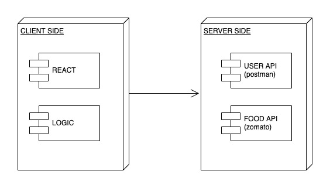
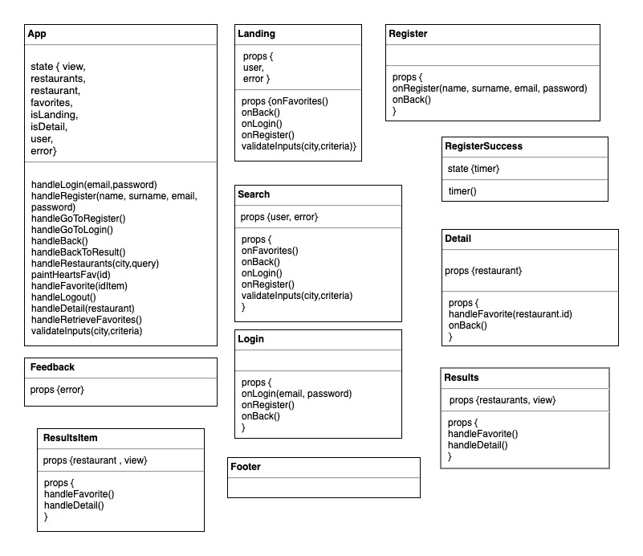
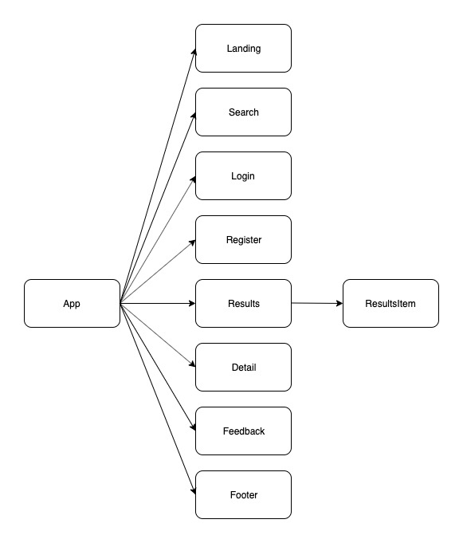
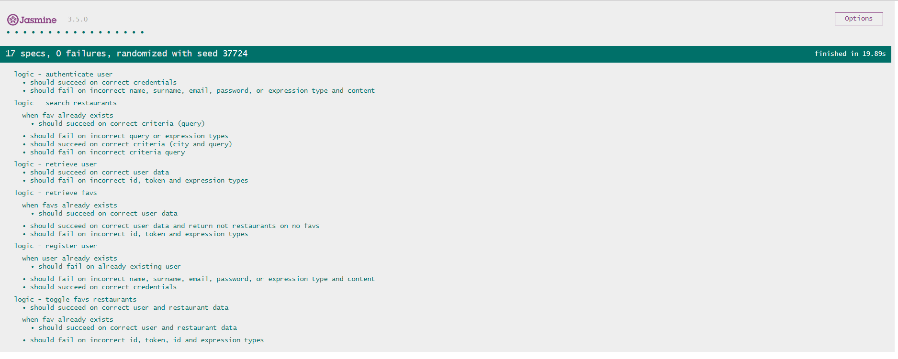

# Eat The World

## Preintroduction

This project is the result of hard teamwork during a week, developed within Skylab bootcamp.

Special thanks to my colleagues mentioned at credits in bottom.


## Introduction

Eat The World is a SPA.

The app brings information about restaurants around the world when the user specifies a city and/or a type of food.
The user can also register, acces to his account and select favourite restaurants that the app will save into 'Favourites' section.
It's possible to login and logout everywhere in the website, respecting the current view to return to.

Those are the countries included in the data base to search restaurants.

- Australia
- Brasil
- Canada
- Chile
- Czech Republic
- India
- Indonesia
- Ireland
- Italy
- Lebanon
- Malaysia
- New Zealand
- Philippines
- Poland
- Portugal
- Qatar
- Singapore
- Slovakia
- South Africa
- Sri Lanka
- Turkey
- UAE
- United Kingdom
- United States

## Usage

**IMPORTANT!**

On the second day of being developing the project, Zomato decided to block totally access to his API from Spain, so in order to continue, we were forced to make the calls through a VPN.

There are many free VPN available for mobile and PC, but we recommend to install the chrome extension [Hotspot Shield VPN free](https://chrome.google.com/webstore/detail/hotspot-shield-vpn-free-p/nlbejmccbhkncgokjcmghpfloaajcffj) to open it from a PC.

Once installed the VPN, the project can be opened here https://diana-moreno.github.io/eat-the-world/.

Otherside, to run it in local, I have included Serve, a local server from an NPM library.

- Install Node.js at the terminal if you haven't yet (https://nodejs.org/es/). Commands for Ubuntu:

```bash
sudo apt-get update
sudo apt-get install nodejs
```
- You will need to install the package manager npm:

```bash
sudo apt-get install npm
```
- Clone or download the repository in your computer.

```bash
git clone https://github.com/diana-moreno/eat-the-world.git`
```
- Download the npm competitions in your own repository and start it.

```bash
npm install serve
npm start
```
- Open the project trought the links are provided by the server.

```
   │   Serving!                                        │
   │                                                   │
   │   - Local:            http://localhost:5000       │
   │   - On Your Network:  http://192.168.1.174:5000   │
   │                                                   │
   │   Copied local address to clipboard!              │
```

## Functional Description

The app has been developed with React following the separate concepts architecture and introducing ES6 elements.

The layout has been done with SASS and has been following BEM rules.

Two APIs have been used: Zomato API and Skylab Coders API. The first was utilized to obtain data from restaurants and the other to obtain and save user data in a database.

Has been managed with Git and Github branches.

### Use Cases


### Flow Diagram


## Technical Description

### Block Diagram



## Components


### Components-React



### Flow Components-React



## Testing



## Credits

Diana Moreno

Elena Rodríguez

Javier Sevilla
